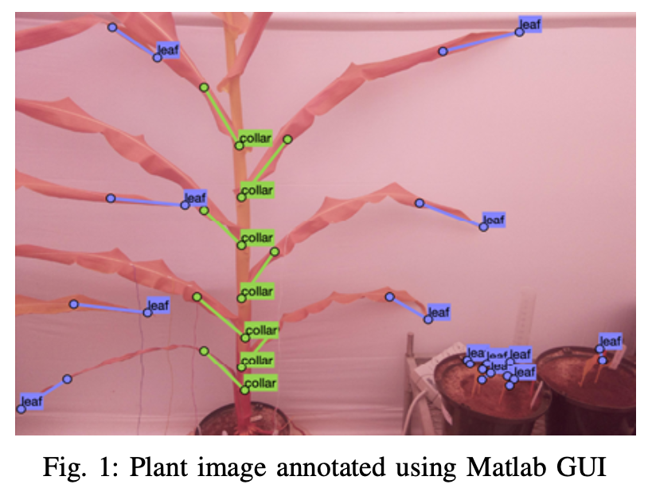
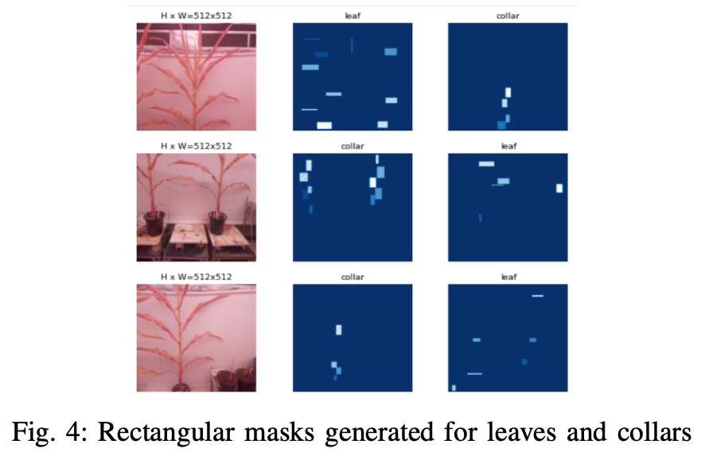
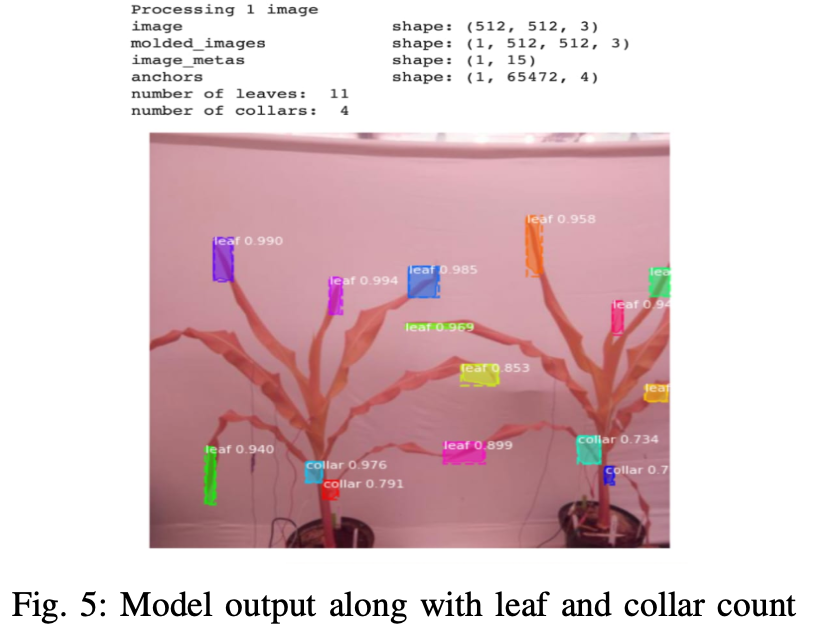
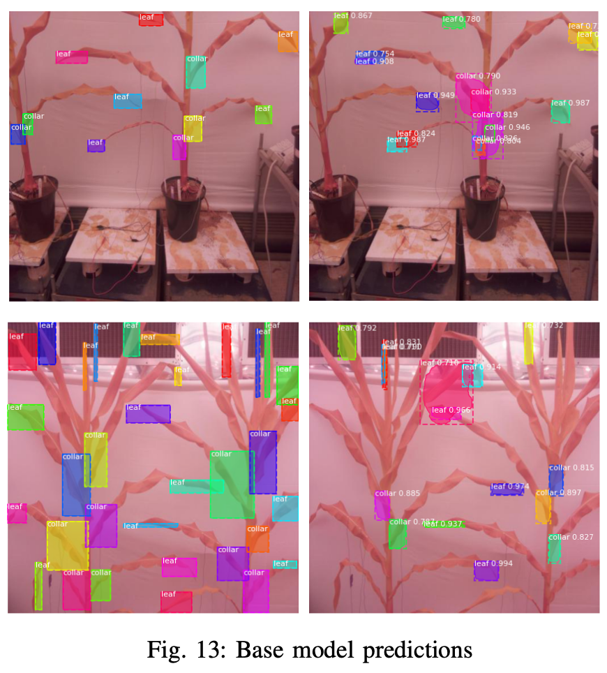
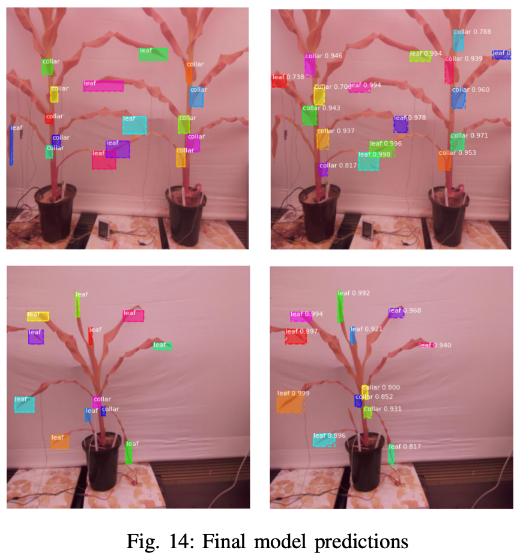
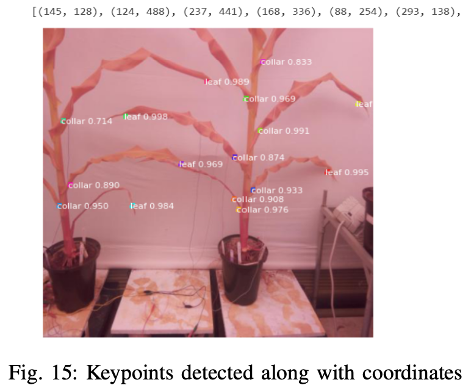
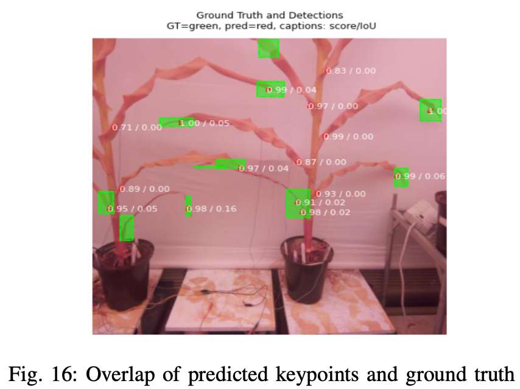
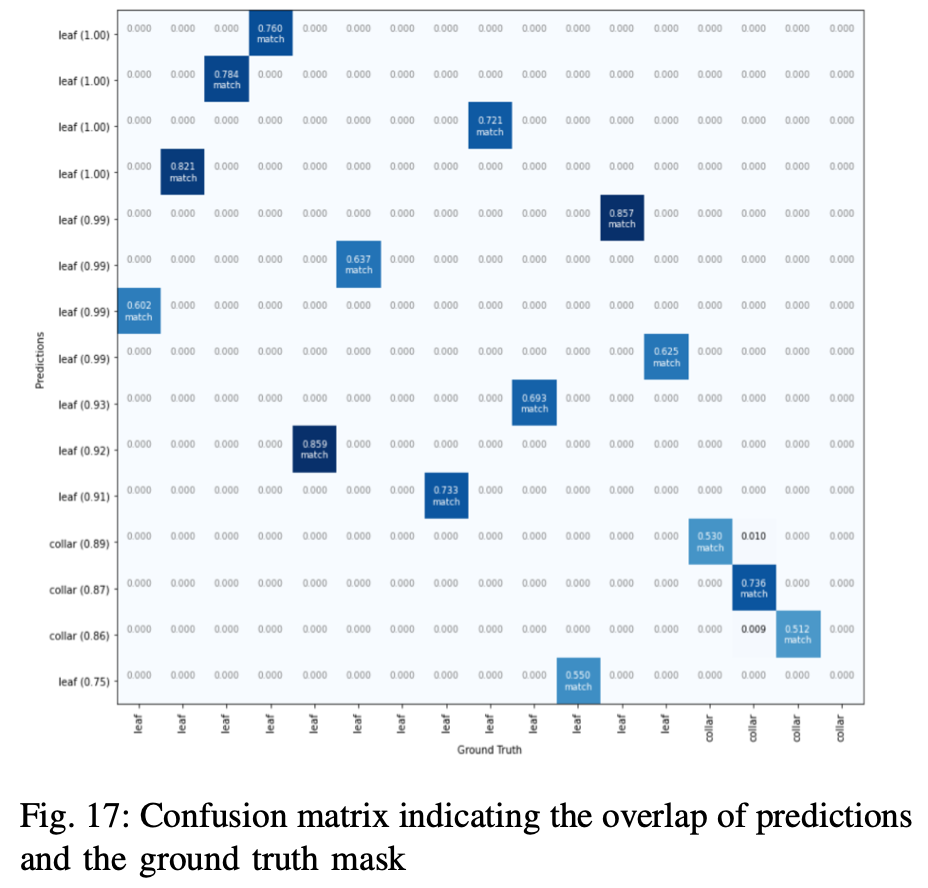

# Deep learning based Plant Phenotyping using Mask R-CNN

For complete report on this project, check out `project_report.pdf` in this repo

### Overview
This project mainly focuses on detection of phenotypic traits such as leaf and collar count in a plant. The images of plants were manually annotated using MATLAB GUI. The data in was generated in COCO format as a JSON file. The proposed implementation is based on Mask R-CNN with ResNet101 as the backbone network.The model output is obtained as bounding box for object detection, mask, class indicating leaf or collar, confidence score and the number of leaves and collars detected along with the corresponding keypoints. The mAP values are obtained for different IoU threshold values greater than 0.5 and the loss for validation and training with respect to the number of epochs is reported. The keypoint locations and the number of leaves and collar detection is compared with the ground truth for model evaluation along with mAP scores.

### Model training and selection
The implementation is based on mask R-CNN (Region- based CNN)[1] with ResNet as backbone network. Mask R- CNN model was implemented based on the GitHub repository by Matterport, Inc[2].

##### A - Data Pre-processing
The image data of soy bean plants were manually annotated indicating leaves and collars using MATLAB GUI as indicated in Figure 1. A total of 476 RGB images of soybean plants were annotated; 5985 annotations of plant leaves and collars were obtained. The annotated ground truth object was converted to COCO format which is widely used for object detection tasks[3], and was saved in a JSON file. Images without annotations (no visible leaf and collar) were removed. Additionally, all images were resized to 512x512 pixels and key-points were mapped onto resized images accordingly. The data was then split into training and validation sets of 301 and 130 images, respectively. The annotations in images in training set were used to train the model.

##### B - The Model
Although there exist models such as Faster R-CNN for high accuracy and YOLO [4] for better speed, the trade-off between accuracy and speed still exist, posing a challenge for real-time object detection. Since speed is not of a major concern here, mask R-CNN model was leveraged to obtain higher detection accuracy of leaves and collars. Mask R-CNN is an extension of faster R-CNN[5] with additional FCN applied to each ROI to predict the segmentation masks in pixel-to-pixel manner.

Object detection with faster R-CNN consists of two stages. The first stage contains Region Proposal Network (RPN) that gives the object bounding boxes.The second stage is basically fast R-CNN[6] that extracts features using ROIPool from each object box and performs classification and bounding box regression. Mask R-CNN adopts the same structure, but in the second stage, along with predicting the class and the bounding box, it outputs a binary mask in parallel. The The backbone network is a standard CNN typically ResNet50 or ResNet101[7] used for feature extraction. This is improved with Feature Pyramid Network (FPN) in order to represent objects at multiple scales. The RPN scans the image similar to a sliding window to detect the regions that contains objects. The regions over which RPN scans are called anchors. RPN generates two outputs for each anchor belonging to either foreground or background class. Foreground class indicates the presence of an object. From RPN output, multiple bounding boxes are generated out of which a single bounding box is selected based on the confidence level for IoU threshold greater than or equal to 0.5 using non-max suppression. For the project implementation, both ResNet50 and ResNet101 were used as the backbone network and their performance was compared.

The image data and the annotated JSON file was loaded, with each keypoint in the annotation consisting of a set of coordinate points. Rectangular masks were generated using the keypoints for model training to achieve better detection as compared to a straight line mask. The rectangular masks generated for leaves and collars are as shown in Figure 4.

The model provides bounding box, mask, confidence score along with the class as the output as indicated in Figure 5. The corresponding count of the detected leaves and collars is also obtained. The midpoint of the ROIs are chosen to obtain the final keypoint predictions. The corresponding overlap of detected keypoints with the ground truth was also obtained.

##### C - Baseline
We wanted to test the capability of Mask-RCNN in object detection even with few epochs and simple backbone network. The baseline model used Mask-RCNN structure as described above but with ResNet50 as backbone network. Compare to ResNet101, ResNet50 was simpler and smaller. The entire model was trained for 10 epochs with just 300 steps/epoch. The model ran validation every 20 steps and kept only 200 and 500 ROIs after non-maximum suppression for inference and training, respectively. All other parameters were set to default. Along with the above indicated base model, the prediction results are also compared against the actual ground truth.

### Results and comparison
The performance of the final model was verified against the initial base model and the ground truth. The base model gave multiple detection and lesser prediction accuracy as shown in Figure 13. The final model detected the leaves and collars with better accuracy and higher confidence level, which can be seen from Figure 14.

The keypoints were obtained by taking the midpoint of the predicted bounding box and is as illustrated in Figure 15. To compare the predicted keypoints with the ground truth, the overlap of keypoints with the ground truth mask, as depicted in Figure 16. Figure 17 shows the confusion matrix for the overlap of the predictions with respect to the ground truth mask.

### Conclusion
It was observed that the model with ResNet101 as the backbone network gave pretty good results for the selected hyperparameters. The detected keypoints along with the leaf and collar count were found to match the actual ground truth to a larger extent. The model can be further improvised to generate accurate predictions in the real-time setting, enabling it to be deployed in agricultural fields. Along with the leaf and collar count, plant height, leaf color, leaf width etc., could be assessed for better prediction of water stress in plants.

### References
[1] P. Dollar K. He, G. Gkioxari and R. Girshick. Mask r-cnn. Proceedings of the IEEE International Conference on Computer Vision, pages 2980– 2988, October 2017.

[2] https://github.com/matterport/Mask RCNN.

[3] http://cocodataset.org/home.

[4] R. Girshick J. Redmon, S. Divvala et al. You only look once: Unified, real-time object detection. May 2016.

[5] S. Ren, K. He, R. B. Girshick, et al. Faster R-CNN: towards real-time object detection with region proposal networks. CoRR, abs/1506.01497, 2015.

[6] R. B. Girshick. Fast R-CNN. CoRR, abs/1504.08083, 2015.

[7] X. Zhang K.He, S. Ren, et al. Deep residual learning for image recognition. CoRR, abs/1512.03385, 2015.
